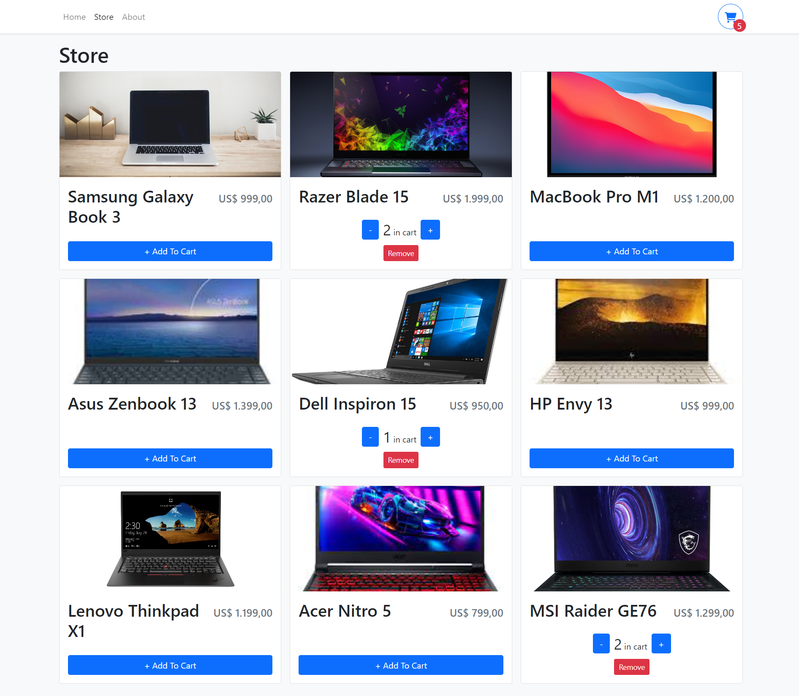
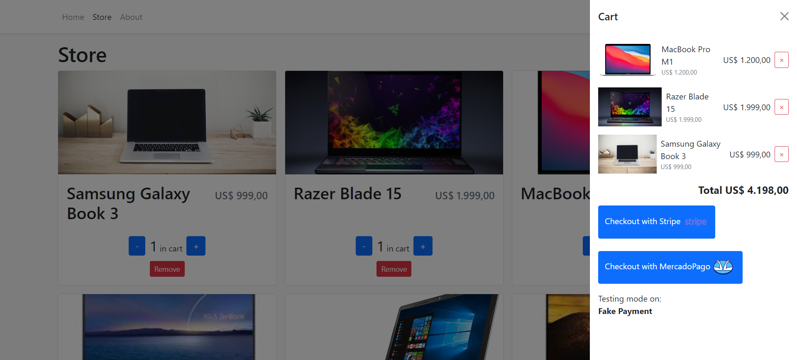

# Shop PC

This is a shop that allows you to sell your products.
In this case, I am going to sell PCs, Netbooks, and MacBooks.
This shop is a SPA(Single Page Application) has an integrated **payment gateway** that allows validating your transactions.

## Tech Stack

TypeScript, Javascript, ReactJS, Vite, Bootstrap, React Hooks.

## Screenshots




## Run Locally

Clone the project

```bash
  git clone https://github.com/FrancoMirandaDev/Shop-Pc-FrontEnd
```

Go to the project directory

```bash
  cd my-project
```

Install dependencies

```bash
  npm install
```

Start the server

```bash
  npm run start
```

## Installation

Install my-project with npm

```bash
  npm install my-project
  cd my-project
```
